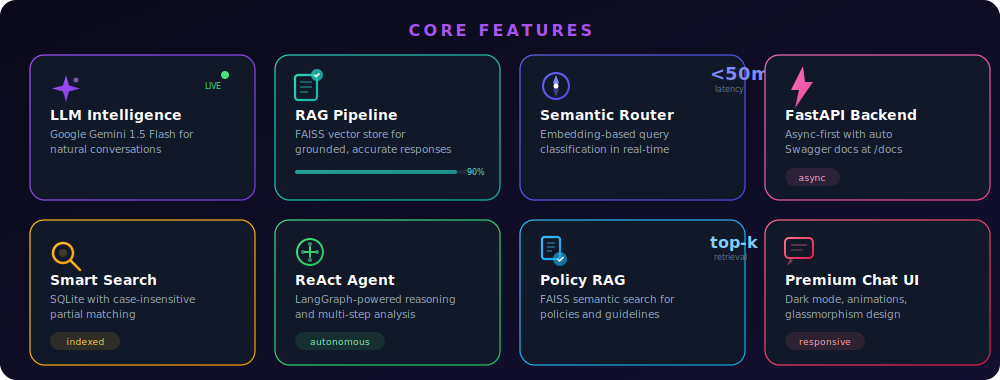

<p align="center">
  
</p>

<p align="center">
  <a href="#-features"></a>
  <a href="#-quick-start"></a>
  <a href="LICENSE"></a>
  <a href="#-contributing"></a>
</p>

<p align="center">
  
  
  
  
  
  
  
</p>

<br/>

<p align="center">
  <b>Not just a chatbot — a <i>decision-making agent</i> that thinks, analyzes, and recommends.</b><br/>
  <sub>Combining RAG · LLMs · Semantic Routing · Intelligent Product Search into one seamless experience.</sub>
</p>

<br/>


## 📋 Table of Contents

<details open>
<summary><b>Click to expand</b></summary>

- [✨ Features](#-features)
- [🏗️ System Architecture](#%EF%B8%8F-system-architecture)
- [🔧 Tech Stack](#-tech-stack)
- [🧠 How It Works](#-how-it-works)
- [📦 Project Structure](#-project-structure)
- [🚀 Quick Start](#-quick-start)
- [💻 Usage & Examples](#-usage--examples)
- [📡 API Reference](#-api-reference)
- [🗂️ Data Schema](#%EF%B8%8F-data-schema)
- [🧭 Routing Deep Dive](#-routing-deep-dive)
- [⚡ Performance](#-performance)
- [🛠️ Customization Guide](#%EF%B8%8F-customization-guide)
- [🗺️ Roadmap](#%EF%B8%8F-roadmap)
- [🔍 Troubleshooting](#-troubleshooting)
- [🤝 Contributing](#-contributing)
- [📄 License](#-license)

</details>


## ✨ Features

<p align="center">
  
</p>


## 🏗️ System Architecture

<p align="center">
  
</p>

> **How data flows through ShopSage AI:**
> 1. User sends a message → FastAPI receives it
> 2. Semantic Router classifies the intent (chitchat vs shopping)  
> 3. Query is routed to the appropriate handler
> 4. Response is generated with context from SQLite/FAISS and returned

<br/>

<table>
<tr>
<th>Layer</th>
<th>Component</th>
<th>Technology</th>
<th>Purpose</th>
</tr>
<tr><td>🎨 Frontend</td><td>Chat UI</td><td>HTML / CSS / JS</td><td>Premium glassmorphism interface</td></tr>
<tr><td>⚡ API</td><td>Web Server</td><td>FastAPI + Uvicorn</td><td>Async request handling + Swagger</td></tr>
<tr><td>🧭 Router</td><td>Semantic Router</td><td>Cosine Similarity</td><td>Real-time query classification</td></tr>
<tr><td>🗨️ Chain</td><td>Chitchat</td><td>Gemini + Memory</td><td>Multi-turn general conversation</td></tr>
<tr><td>🤖 Agent</td><td>Shopping Agent</td><td>LangGraph ReAct</td><td>Autonomous product intelligence</td></tr>
<tr><td>🔍 Tool</td><td>Product Search</td><td>SQLite + Indexing</td><td>Fast inventory queries</td></tr>
<tr><td>📋 Tool</td><td>Policy Search</td><td>FAISS RAG</td><td>Semantic policy retrieval</td></tr>
</table>


## 🔧 Tech Stack

<p align="center">
  
</p>


## 🧠 How It Works

### The Decision Framework

ShopSage AI doesn't just answer questions — it **reasons through decisions** using a multi-step framework:

```
┌─────────────────────────────────────────────────────────────────┐
│                    USER QUERY RECEIVED                          │
│              "Show me red shirts under ₹3000"                   │
└──────────────────────┬──────────────────────────────────────────┘
                       │
                       ▼
┌──────────────────────────────────────────────────────────────────┐
│  STEP 1: CLASSIFY                                                │
│  Semantic Router embeds query → cosine similarity → "shopping"   │
└──────────────────────┬───────────────────────────────────────────┘
                       │
                       ▼
┌──────────────────────────────────────────────────────────────────┐
│  STEP 2: SEARCH                                                  │
│  Shopping Agent activates Product Search Tool                    │
│  → SQLite: SELECT * WHERE color LIKE '%red%'                     │
│            AND product_name LIKE '%shirt%' AND price < 3000      │
└──────────────────────┬───────────────────────────────────────────┘
                       │
                       ▼
┌──────────────────────────────────────────────────────────────────┐
│  STEP 3: ANALYZE                                                 │
│  Agent evaluates results on:                                     │
│  • Price efficiency (30%) • Features (25%) • Brand (10%)         │
│  • Review sentiment (25%) • User preference match (10%)          │
└──────────────────────┬───────────────────────────────────────────┘
                       │
                       ▼
┌──────────────────────────────────────────────────────────────────┐
│  STEP 4: RECOMMEND                                               │
│  🥇 Best Choice → Nike Dri-FIT Red Tee — ₹2,499                 │
│  🥈 Alternative → Adidas Sport Red — ₹1,999                     │
│  🧠 Verdict → "Best value for quality + brand reliability"       │
└──────────────────────────────────────────────────────────────────┘
```

### Three Response Paths

| Path | Trigger | Handler | Memory |
|:-----|:--------|:--------|:-------|
| 🗨️ **Chitchat** | Greetings, weather, general talk | `ChitchatChain` — Gemini + ConversationBufferMemory | Per-session |
| 🛒 **Shopping** | Product queries, comparisons, recommendations | `ShoppingAgent` — LangGraph ReAct with tools | Per-session |
| 📋 **Policy** | Return policy, shipping, warranties | `ShoppingAgent` → Policy Search Tool (FAISS) | Per-session |


## 📦 Project Structure

```
ShopSageAI/
│
├── 📄 app.py                          # FastAPI entry point (uvicorn)
├── 📄 requirements.txt                # All Python dependencies
├── 📄 .env.example                    # Environment variable template
├── 📄 .gitignore                      # Git ignore rules
├── 📄 LICENSE                         # MIT License
│
├── 📂 assets/                         # SVG graphics for README
│   ├── banner.svg                     # Animated hero banner
│   ├── architecture.svg               # System architecture diagram
│   ├── tech_stack.svg                 # Technology showcase
│   ├── features.svg                   # Feature cards
│   └── divider.svg                    # Section dividers
│
├── 📂 scripts/
│   └── init_db.py                     # Database & FAISS initialization
│
├── 📂 data/
│   ├── policy.txt                     # Company policies (source)
│   ├── products.db                    # SQLite database (generated)
│   └── faiss_index/                   # Vector store (generated)
│       ├── index.faiss
│       └── index.pkl
│
├── 📂 shopsage/                       # Core Python package
│   ├── __init__.py
│   ├── config.py                      # Central configuration
│   │
│   ├── router/
│   │   ├── __init__.py
│   │   └── semantic_router.py         # Embedding-based classification
│   │
│   ├── chain/
│   │   ├── __init__.py
│   │   └── chitchat_chain.py          # General conversation handler
│   │
│   ├── agent/
│   │   ├── __init__.py
│   │   └── shopping_agent.py          # LangGraph ReAct agent
│   │
│   ├── tool/
│   │   ├── __init__.py
│   │   ├── product_search.py          # SQLite product search
│   │   └── policy_search.py           # FAISS policy retrieval
│   │
│   └── utils/
│       ├── __init__.py
│       └── data_loader.py             # ProductDataLoader class
│
├── 📂 static/
│   ├── css/
│   │   └── style.css                  # Premium dark-mode styles
│   └── js/
│       └── chat.js                    # Chat interaction logic
│
└── 📂 templates/
    └── index.html                     # Chat interface template
```


## 🚀 Quick Start

### Prerequisites

| Requirement | Version | Link |
|:------------|:--------|:-----|
| Python | 3.10+ | [python.org](https://python.org) |
| Google API Key | — | [Google AI Studio](https://aistudio.google.com/) |
| pip | Latest | Included with Python |

### Installation

```bash
# 1. Clone the repository
git clone https://github.com/DevChiniwala/ShopSageAI.git
cd ShopSageAI

# 2. Create virtual environment
python -m venv venv
source venv/bin/activate          # macOS/Linux
venv\Scripts\activate             # Windows

# 3. Install dependencies
pip install -r requirements.txt

# 4. Configure environment
cp .env.example .env
# Edit .env and add: GOOGLE_API_KEY=your_key_here

# 5. Initialize database & vector store
python scripts/init_db.py

# 6. Launch! 🚀
uvicorn app:app --reload
```

> 🌐 Open **[http://localhost:8000](http://localhost:8000)** and start shopping!  
> 📖 API docs at **[http://localhost:8000/docs](http://localhost:8000/docs)**


## 💻 Usage & Examples

### 🔍 Product Discovery

```
You: What red shirts do you have in stock?

🛒 ShopSage AI:
I found 3 red shirts currently in stock! Here's my analysis:

🥇 Best Choice
   Name: Nike Dri-FIT Classic Red Tee
   Price: ₹2,499 | Size: S, M, L, XL | Stock: 45 units
   Why: Best balance of brand quality and price point

🥈 Alternatives
   1. Adidas Sport Red Polo — ₹1,999 (budget-friendly)
   2. Puma Essential Red — ₹1,299 (most affordable)

⚖️ Comparison
   Nike offers superior material quality (100% polyester Dri-FIT)
   Adidas has wider size range including XXL
   Puma is best value if budget is the priority

🧠 Verdict
   For everyday wear with reliable quality, the Nike Dri-FIT is your
   best bet. If you're budget-conscious, Puma delivers great value.
```

### 📋 Policy Inquiry

```
You: What's your return policy?

📋 ShopSage AI:
Here's our return policy:

• 30-day return window from date of delivery
• Items must be unworn with original tags attached
• Free returns on all domestic orders
• Refund processed within 5-7 business days
• Exchange available for different size/color
• Sale items: store credit only (no cash refund)

Need help with a specific return? Just let me know! 🛍️
```

### 🗨️ Casual Chat

```
You: Hey! What can you help me with?

🗨️ ShopSage AI:
Hello! 👋 Great to meet you!

I'm ShopSage AI, your intelligent shopping companion. Here's what I can do:

🔍 Search products by color, size, brand, price, or any criteria
📊 Compare multiple products and recommend the best one
📋 Answer questions about our policies (returns, shipping, etc.)
💬 Have a friendly conversation about anything!

Try asking me: "Show me blue jackets under ₹5000" 🛍️
```


## 📡 API Reference

### `POST /chat`

Send a message and receive an AI-powered response.

**Request:**
```json
{
  "message": "Show me blue jackets under ₹5000",
  "session_id": "550e8400-e29b-41d4-a716-446655440000"
}
```

**Response:**
```json
{
  "response": "I found 2 blue jackets in your budget...",
  "route": "shopping",
  "session_id": "550e8400-e29b-41d4-a716-446655440000"
}
```

| Field | Type | Description |
|:------|:-----|:------------|
| `message` | `string` | User's query (required) |
| `session_id` | `string` | UUID for conversation continuity (optional — auto-generated if missing) |
| `response` | `string` | AI-generated response |
| `route` | `string` | Classification result: `"shopping"` or `"chitchat"` |

### All Endpoints

| Method | Path | Description |
|:-------|:-----|:------------|
| `GET` | `/` | Chat interface (Web UI) |
| `POST` | `/chat` | Send message → AI response |
| `GET` | `/docs` | Swagger API documentation |
| `GET` | `/redoc` | ReDoc API documentation |


## 🗂️ Data Schema

### Products Table (SQLite)

| Column | Type | Description | Example |
|:-------|:-----|:------------|:--------|
| `product_code` | TEXT | Unique identifier | `"NK-RED-001"` |
| `product_name` | TEXT | Product name | `"Nike Dri-FIT Classic"` |
| `material` | TEXT | Material composition | `"100% Polyester"` |
| `size` | TEXT | Available sizes | `"S, M, L, XL"` |
| `color` | TEXT | Color | `"Red"` |
| `brand` | TEXT | Brand name | `"Nike"` |
| `gender` | TEXT | Target demographic | `"Unisex"` |
| `stock_quantity` | INTEGER | Units available | `45` |
| `price` | REAL | Price in ₹ | `2499.00` |

### Policy Store (FAISS)

| Property | Value |
|:---------|:------|
| Embedding Model | `models/embedding-001` |
| Chunk Size | 500 tokens |
| Chunk Overlap | 100 tokens |
| Similarity Metric | Cosine |
| Top-K Retrieval | 3 |


## 🧭 Routing Deep Dive

### How Semantic Router Classifies Queries

```
               User Query
                   │
                   ▼
        ┌─────────────────────┐
        │   Embed with Google  │
        │   Embedding Model    │
        └──────────┬──────────┘
                   │
                   ▼
        ┌─────────────────────┐
        │  Cosine Similarity   │
        │  vs Route Utterances │
        └──────────┬──────────┘
                   │
           ┌───────┴───────┐
           │               │
     score > 0.8      score < 0.8
           │               │
    ┌──────┴──────┐   ┌────┴────┐
    │  Best Match  │   │Fallback │
    │  Route Wins  │   │Chitchat │
    └─────────────┘   └─────────┘
```

### Route Definitions

**Shopping Route** — Triggered by queries about:
> products, prices, stock, availability, comparisons, recommendations,
> "show me", "find", "search", "compare", "best", "cheapest", "under ₹"

**Chitchat Route** — Triggered by queries about:
> greetings, weather, jokes, general knowledge, "how are you",
> "tell me about yourself", "what can you do", "hello", "thanks"


## ⚡ Performance

| Metric | Value | Details |
|:-------|:------|:--------|
| **Route Classification** | ~50ms | Embedding + cosine similarity |
| **Product Search** | ~10ms | Indexed SQLite queries |
| **Policy Retrieval** | ~30ms | FAISS similarity search |
| **LLM Response** | ~1-3s | Gemini 1.5 Flash generation |
| **End-to-End** | ~1.5-4s | Full query → response cycle |
| **Concurrent Users** | 50+ | FastAPI async architecture |


## 🛠️ Customization Guide

| What to Change | File | How |
|:---------------|:-----|:----|
| Product inventory | `scripts/init_db.py` | Modify product data, re-run script |
| Company policies | `data/policy.txt` | Edit text, re-run `init_db.py` |
| AI personality | `shopsage/agent/shopping_agent.py` | Update system prompt |
| Chat style | `shopsage/chain/chitchat_chain.py` | Adjust conversation prompt |
| Route patterns | `shopsage/router/semantic_router.py` | Add/modify utterance samples |
| LLM model | `shopsage/config.py` | Change `MODEL_NAME` variable |
| Search logic | `shopsage/tool/product_search.py` | Modify SQL queries |
| UI theme | `static/css/style.css` | Change colors, fonts, animations |
| Embedding model | `shopsage/config.py` | Change `EMBEDDING_MODEL` variable |


## 🗺️ Roadmap

- [x] Core chat interface with dark mode UI
- [x] Semantic query routing (chitchat vs shopping)
- [x] Product search with SQLite
- [x] Policy RAG with FAISS
- [x] LangGraph ReAct agent for shopping
- [x] Conversation memory per session
- [ ] Streaming responses (SSE)
- [ ] Image-based product search
- [ ] Multi-language support (Vietnamese, Hindi)
- [ ] User authentication & order history
- [ ] Wishlist & cart management
- [ ] Voice input support
- [ ] Deployment templates (Docker, Railway)


## 🔍 Troubleshooting

<details>
<summary><b>🔑 API Key Issues</b></summary>

- Ensure `GOOGLE_API_KEY` is correctly set in `.env`
- Verify the key is active at [Google AI Studio](https://aistudio.google.com/)
- Check that Generative AI API is enabled for your project
- Make sure there are no trailing spaces in the key

</details>

<details>
<summary><b>📦 Database Not Found</b></summary>

- Run `python scripts/init_db.py` to initialize
- Verify `data/products.db` and `data/faiss_index/` exist
- Check file permissions on the `data/` directory

</details>

<details>
<summary><b>🚫 Import / Dependency Errors</b></summary>

- Ensure virtual environment is activated
- Run `pip install -r requirements.txt` again
- Check Python version: `python --version` (need 3.10+)
- Try: `pip install --upgrade pip` first

</details>

<details>
<summary><b>⚡ Server Won't Start</b></summary>

- Check if port 8000 is already in use: `lsof -i :8000`
- Try alternate port: `uvicorn app:app --reload --port 8001`
- Check console for detailed error messages
- Verify all files in `shopsage/` have `__init__.py`

</details>

<details>
<summary><b>🤖 Agent Returns Empty / Error Responses</b></summary>

- Verify database has products: `sqlite3 data/products.db "SELECT COUNT(*) FROM products;"`
- Check FAISS index exists: `ls data/faiss_index/`
- Review agent logs in console for tool execution errors
- Ensure Gemini API quota is not exceeded

</details>


## 🤝 Contributing

We welcome contributions! Here's how to get started:

```bash
# 1. Fork the repo on GitHub

# 2. Clone your fork
git clone https://github.com/YOUR_USERNAME/ShopSageAI.git

# 3. Create a feature branch
git checkout -b feature/amazing-feature

# 4. Make changes, commit
git add .
git commit -m "feat: add amazing feature"

# 5. Push and open a PR
git push origin feature/amazing-feature
```

### Contribution Guidelines

- Follow existing code style and conventions
- Add docstrings to all new functions
- Update README if adding new features
- Test your changes before submitting


## 📄 License

This project is licensed under the **MIT License** — see the [LICENSE](LICENSE) file for details.


<p align="center">
  <b>Built with ❤️ and AI</b><br/>
  <sub>If you found ShopSage AI useful, consider giving it a ⭐</sub>
</p>

<p align="center">
  <a href="#"></a>
</p>
