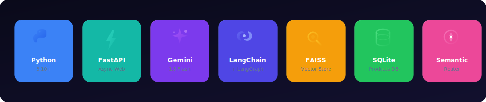

<p align="center">
  
</p>

<p align="center">
  <a href="#-features"></a>
  <a href="#-installation"></a>
  <a href="LICENSE"></a>
  <a href="#-contributing"></a>
</p>

<p align="center">
  
  
  
  
  
  
</p>

<p align="center">
  <b>🧠 AI-Powered Shopping Assistant</b> — Combining RAG, LLMs, Semantic Routing & Intelligent Product Search<br/>
  <i>Not just a chatbot. A <b>decision-making agent</b> that thinks, analyzes, and recommends.</i>
</p>


## 📋 Table of Contents

- [✨ Features](#-features)
- [🏗️ System Architecture](#️-system-architecture)
- [🔧 Tech Stack](#-tech-stack)
- [📦 Project Structure](#-project-structure)
- [🚀 Installation](#-installation)
- [💻 Usage](#-usage)
- [🗂️ Data Structure](#️-data-structure)
- [🧭 Advanced Routing](#-advanced-routing)
- [🧠 How It Works](#-how-it-works)
- [🛠️ Customization](#️-customization)
- [🔍 Troubleshooting](#-troubleshooting)
- [🤝 Contributing](#-contributing)
- [📄 License](#-license)


## ✨ Features

<table>
<tr>
<td width="50%">

### 🧠 Large Language Models
Leverages **Google Gemini 1.5 Flash** for natural, context-aware conversations with lightning-fast response times.

### 📚 RAG Pipeline
Retrieval-Augmented Generation using **FAISS** vector store ensures accurate, grounded responses backed by real data.

### 🛣️ Semantic Router
Intelligently classifies and routes queries using embedding-based similarity — instant routing, zero waste.

### 🔍 Smart Product Search
Case-insensitive, partial-match search powered by optimized **SQLite** queries with full-text indexing.

</td>
<td width="50%">

### 💬 Intelligent Chat Interface
Premium dark-mode UI with real-time messaging, typing indicators, and smooth animations.

### ⚡ FastAPI Backend
Async-first architecture with auto-generated API docs, CORS support, and blazing performance.

### 🤖 ReAct Agent
**LangGraph**-powered agent that reasons through multi-step product analysis and comparison.

### 📋 Policy RAG
Instant retrieval of company policies, return guidelines, and shipping info via semantic search.

</td>
</tr>
</table>


## 🏗️ System Architecture

<p align="center">
  
</p>

ShopSage AI uses a **modular, scalable architecture** with intelligent query routing:

| Layer | Component | Technology | Purpose |
|:------|:----------|:-----------|:--------|
| 🎨 **Frontend** | Chat UI | HTML/CSS/JS | Premium user interface |
| ⚡ **API** | Web Server | FastAPI + Uvicorn | Async request handling |
| 🧭 **Router** | Semantic Router | Google Embeddings | Query classification |
| 🗨️ **Chain** | Chitchat Chain | Gemini + Memory | General conversation |
| 🛒 **Agent** | Shopping Agent | LangGraph ReAct | Product intelligence |
| 🔍 **Tools** | Product Search | SQLite | Inventory queries |
| 📋 **Tools** | Policy Search | FAISS RAG | Policy retrieval |


## 🔧 Tech Stack

<p align="center">
  
</p>


## 📦 Project Structure

```
ShopSageAI/
│
├── 📄 app.py                          # FastAPI entry point
├── 📄 requirements.txt                # Dependencies
├── 📄 .env.example                    # Environment template
├── 📄 .gitignore                      # Git ignore rules
├── 📄 LICENSE                         # MIT License
│
├── 📂 scripts/
│   └── init_db.py                     # Database & FAISS initialization
│
├── 📂 data/
│   ├── policy.txt                     # Company policies
│   ├── products.db                    # SQLite database (generated)
│   └── faiss_index/                   # Vector store (generated)
│
├── 📂 shopsage/                       # Core package
│   ├── config.py                      # Central configuration
│   ├── router/
│   │   └── semantic_router.py         # Query classification
│   ├── chain/
│   │   └── chitchat_chain.py          # General conversation
│   ├── agent/
│   │   └── shopping_agent.py          # Shopping intelligence
│   ├── tool/
│   │   ├── product_search.py          # SQLite product search
│   │   └── policy_search.py           # FAISS policy search
│   └── utils/
│       └── data_loader.py             # Data loading utilities
│
├── 📂 static/
│   ├── css/style.css                  # Premium UI styles
│   └── js/chat.js                     # Chat logic
│
└── 📂 templates/
    └── index.html                     # Chat interface
```


## 🚀 Installation

### Prerequisites

- Python 3.10 or higher
- [Google API Key](https://aistudio.google.com/) (for Gemini & Embeddings)

### Step-by-Step Setup

**1. Clone the repository**

```bash
git clone https://github.com/yourusername/ShopSageAI.git
cd ShopSageAI
```

**2. Create and activate a virtual environment**

```bash
python -m venv venv

# Linux / macOS
source venv/bin/activate

# Windows
venv\Scripts\activate
```

**3. Install dependencies**

```bash
pip install -r requirements.txt
```

**4. Configure environment variables**

```bash
cp .env.example .env
```

Edit `.env` and add your API key:

```env
GOOGLE_API_KEY=your_google_api_key_here
```

**5. Initialize the database**

```bash
python scripts/init_db.py
```

> This creates the SQLite product database and builds the FAISS vector index from policy documents.

**6. Launch ShopSage AI** 🚀

```bash
uvicorn app:app --reload
```

Visit **[http://localhost:8000](http://localhost:8000)** — you're ready to shop! 🛍️


## 💻 Usage

### 💬 Example Conversations

<table>
<tr>
<td width="33%" align="center">
<h4>🔍 Product Search</h4>
</td>
<td width="33%" align="center">
<h4>📋 Policy Query</h4>
</td>
<td width="33%" align="center">
<h4>🗨️ General Chat</h4>
</td>
</tr>
<tr>
<td>

```
You: What red shirts do you 
     have in stock?

🛒 ShopSage: I found 3 red 
shirts for you...

🥇 Best Choice:
   Nike Dri-FIT — ₹2,499
   
🥈 Alternatives:
   1. Adidas Sport — ₹1,999
   2. Puma Classic — ₹1,299
```

</td>
<td>

```
You: What's your return 
     policy?

📋 ShopSage: Our return 
policy allows...

• 30-day return window
• Free returns on all items
• Refund within 5-7 days
• Original packaging required
```

</td>
<td>

```
You: Hey! How are you?

🗨️ ShopSage: Hello! 👋 
I'm doing great, thanks 
for asking!

I'm your ShopSage AI 
assistant — ready to help 
you find the perfect 
products today! 🛍️
```

</td>
</tr>
</table>

### 📡 API Endpoints

| Method | Endpoint | Description |
|:-------|:---------|:------------|
| `GET` | `/` | Chat interface (Web UI) |
| `POST` | `/chat` | Send message & get AI response |
| `GET` | `/docs` | Swagger API documentation |

#### POST `/chat` — Request

```json
{
  "message": "Show me blue jackets under ₹5000",
  "session_id": "user-uuid-here"
}
```

#### POST `/chat` — Response

```json
{
  "response": "I found 2 blue jackets in your budget...",
  "route": "shopping"
}
```


## 🗂️ Data Structure

Product data is stored in **SQLite** with the following schema:

| Field | Type | Description |
|:------|:-----|:------------|
| `product_code` | TEXT | Unique product identifier |
| `product_name` | TEXT | Name of the product |
| `material` | TEXT | Material composition |
| `size` | TEXT | Available sizes (S, M, L, XL...) |
| `color` | TEXT | Available colors |
| `brand` | TEXT | Manufacturer / brand |
| `gender` | TEXT | Target gender (Men / Women / Unisex) |
| `stock_quantity` | INTEGER | Units in stock |
| `price` | REAL | Price in ₹ |


## 🧭 Advanced Routing

ShopSage AI uses **multi-layer query classification** for maximum accuracy:

```
User Query
    │
    ▼
┌─────────────────────────┐
│   Semantic Router       │──── Embedding-based cosine similarity
│   (Primary Classifier)  │     between query and route utterances
└──────────┬──────────────┘
           │
     ┌─────┴─────┐
     ▼           ▼
 🗨️ Chitchat   🛒 Shopping
    Chain         Agent
```

- **Semantic Router** — Uses `GoogleGenerativeAIEmbeddings` with cosine similarity to classify queries in real-time
- **Route Definitions** — Curated utterance samples for shopping and chitchat categories
- **Fallback Logic** — Unclassified queries default to friendly chitchat responses


## 🧠 How It Works

### 1️⃣ Query Classification
User input is embedded and compared against predefined route patterns using **cosine similarity** — routing to either the Chitchat Chain or Shopping Agent.

### 2️⃣ Chitchat Path
General queries are handled by **Gemini 1.5 Flash** with `ConversationBufferMemory` for multi-turn context awareness.

### 3️⃣ Shopping Path
Product queries activate the **LangGraph ReAct Agent**, which autonomously:
- Searches the product database (SQLite)
- Retrieves relevant policies (FAISS RAG)
- Analyzes and compares products
- Recommends the best options with reasoning

### 4️⃣ Response Generation
The agent formats responses with structured recommendations:
- 🥇 **Best Choice** — Top recommendation with reasoning
- 🥈 **Alternatives** — Runner-up options
- ⚖️ **Comparison** — Key trade-offs
- 🧠 **Verdict** — Personalized final recommendation


## 🛠️ Customization

| What to Customize | File to Edit | Details |
|:------------------|:-------------|:--------|
| Product inventory | `data/products.db` | Run `scripts/init_db.py` with your data |
| Company policies | `data/policy.txt` | Edit text, then rebuild FAISS index |
| Search behavior | `shopsage/tool/product_search.py` | Modify query logic and formatting |
| AI personality | `shopsage/agent/shopping_agent.py` | Update system prompt |
| Chat responses | `shopsage/chain/chitchat_chain.py` | Adjust conversation style |
| Route definitions | `shopsage/router/semantic_router.py` | Add/modify utterance samples |
| LLM model | `shopsage/config.py` | Switch Gemini model version |


## 🔍 Troubleshooting

<details>
<summary><b>🔑 API Key Issues</b></summary>

- Ensure `GOOGLE_API_KEY` is set in your `.env` file
- Verify the key is active at [Google AI Studio](https://aistudio.google.com/)
- Check that the API has been enabled for your project

</details>

<details>
<summary><b>📦 Database Not Found</b></summary>

- Run `python scripts/init_db.py` to initialize
- Verify `data/products.db` and `data/faiss_index/` exist
- Check file permissions

</details>

<details>
<summary><b>🚫 Import Errors</b></summary>

- Ensure virtual environment is activated
- Run `pip install -r requirements.txt` again
- Verify Python version: `python --version` (need 3.10+)

</details>

<details>
<summary><b>⚡ Server Won't Start</b></summary>

- Check if port 8000 is already in use
- Try: `uvicorn app:app --reload --port 8001`
- Check console for detailed error messages

</details>


## 🤝 Contributing

Contributions make ShopSage AI better! Here's how:

```bash
# 1. Fork the repository

# 2. Create your feature branch
git checkout -b feature/AmazingFeature

# 3. Make your changes and commit
git commit -m "Add AmazingFeature"

# 4. Push to your branch
git push origin feature/AmazingFeature

# 5. Open a Pull Request
```

> Please follow existing code conventions and update tests as appropriate.


## 📄 License

This project is licensed under the **MIT License** — see the [LICENSE](LICENSE) file for details.


<p align="center">
  <b>Built with ❤️ and AI</b><br/>
  <sub>If you found this useful, please consider giving it a ⭐</sub>
</p>

<p align="center">
  <a href="#"></a>
</p>
